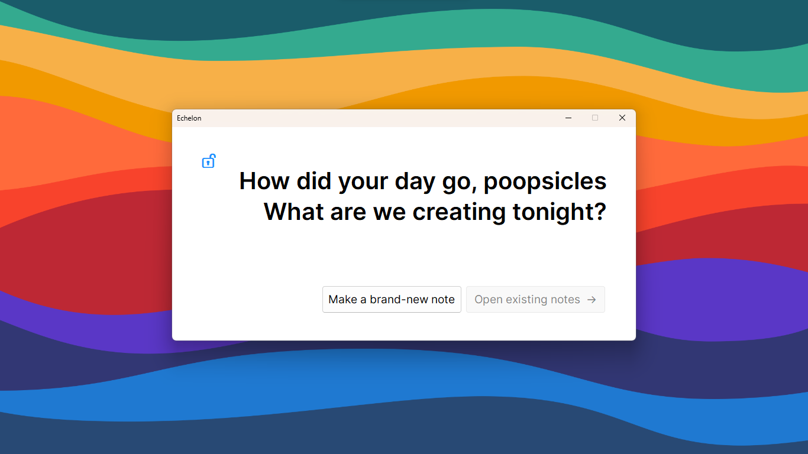
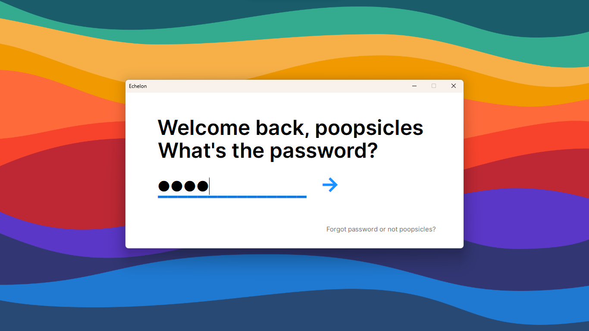

# Echelon

A nice, no-frills, kinda-over-the-top-in-the-security-aspect note taking app, implemented with C# and [Windows Forms](https://docs.microsoft.com/en-us/dotnet/desktop/winforms/overview/?view=netdesktop-6.0#introduction).

So, our uni "project" for one of our programming courses for the semester (I put project in quotes because it was only 15% of our total grade and could be done in 10 minutes if you were *really* determined) was to connect a nice fancy GUI application to a not-so-fancy database backend. And since we had, over the course of the term, used WinForms for anything that wasn't a Console Application, it went without saying that you didn't, in fact, need to use it at all and you could do anything you wanted...as long as:

1. It had a nice window, so a graphical user interface
2. It was made with C#, as that was the language of the ~~week~~ semester
3. It connected to a database (or at least, looked like it connected to a database...you could hard-code but that's just stressful)

So, I thought I'd be all fancy and use [AvaloniaUI](https://avaloniaui.net/) because of cross-platform-ness (and not because one of my friends was using [Xamarin.Mac](https://visualstudio.microsoft.com/vs/mac/xamarin/)).

Anyways, that dream went in the mud very fast.
And then I turned to good ol' WinForms to save me.

As for the database, we were using MariaDB with [XAMPP](https://www.apachefriends.org/), but I chose to use SQLite with Microsoft's [EF Core](https://docs.microsoft.com/en-us/ef/core/) because, well in all honesty it was just easier (and I didn't want to have to open ports and run a server and all that).

I also thought it should be "secure" though...so no one could theoretically, open your device, spy on the SQLite database file and know all your secrets...and well, yay for AES encryption and everything because I actually managed to implement that.

So yeah, a nice-looking, pretty secure notes app.
I ended up getting 14 out of 15, because *no one* gets to get full marks haha.

## Features

- Security - by default, all notes are protected with state-of-the-art encryption techniques
- Minimalism - designed to allow you to focus on the one thing that matters, taking down your notes
- Exporting - if you need to allow your notes to be shared, they can be exported in Markdown, which can be opened in any text editor

## Security overview

You should read up a bit on [asymmetric crytography](https://en.wikipedia.org/wiki/Public-key_cryptography) to understand what's really happening here.

A nicer, less technical intro. can also be found [here](https://www.techtarget.com/searchsecurity/definition/asymmetric-cryptography).

The application implements its security in the following ways:

- User onboarding
  1. The user chooses a password for logging in
  2. The password is then hashed, and stored in a table (`H`)
  3. A public-private key pair is generated for the user (`P+`, `P-`)
  4. `P-` is then encrypted with the plaintext password and stored in the table (`E(P-)`), along with `P+`
- User login
  1. The password is input from the user, hashed, and then compared to the stored password hash to check for validity
  2. Once validated, it is then used to decrypt the `E(P-)` and return `P-`
- Note creation
  1. A note is created, along with a symmetric key to protect its contents (`N±`)
  2. The symmetric key is then encrypted with `P+` and stored in the database (`E(N±)`)
- Note retrieval
  1. `P-`is used to unlock the encrypted symmetric key to produce `N±`
  2. The contents of the note are then decrypted with `N±` and shown to the user
  3. Once changes are made to the contents, they are again encrypted with `N±` and stored in the database

On close, all of the keys are discarded from memory so that the passpwrd will be needed to unlock everything again.

## Screenshots

|  |
|:--:|
| *The homepage viewed when logged in* |

|  |
|:--:|
| *The login prompt* |

|  |
|:--:|
| *A note as seen in the application* |

|  |
|:--:|
| *The note as stored in the database* |

## Downloading the application

Simply get the latest release from [Releases](https://github.com/poopsicles/EchelonForms/releases)

## Building from source

1. Get the SF Pro fonts from the [Apple Developer website](https://devimages-cdn.apple.com/design/resources/download/SF-Pro.dmg) and unzip with a tool like [7-Zip](https://www.7-zip.org/download.html) if you do not have a Mac at hand.
2. Install Visual Studio 2022 with the .NET development workload selected
3. Clone this repository with `git`
4. Open `Echelon.sln` with Visual Studio
5. Click the Build button

You can also use the `dotnet` CLI tool to build it, simply navigate into the Echelon folder and run `dotnet build`.

Have a look at [Deploy .NET Core apps with Visual Studio](https://docs.microsoft.com/en-us/dotnet/core/deploying/deploy-with-vs?tabs=vs156) and [Publish .NET apps with the .NET CLI](https://docs.microsoft.com/en-us/dotnet/core/deploying/deploy-with-cli) if you want to make a self-contained, shareable executable.

## To-do

- Tracking note changes
  - Adding an undo capability
  - Not overwriting the save (and date modified) if there's nothing new to save
